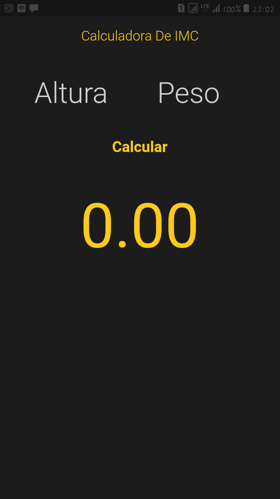
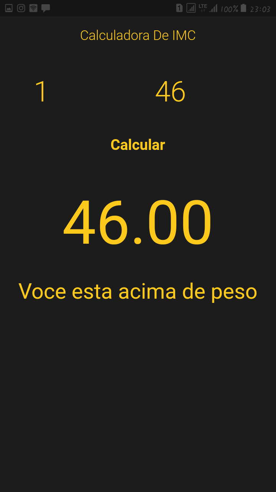
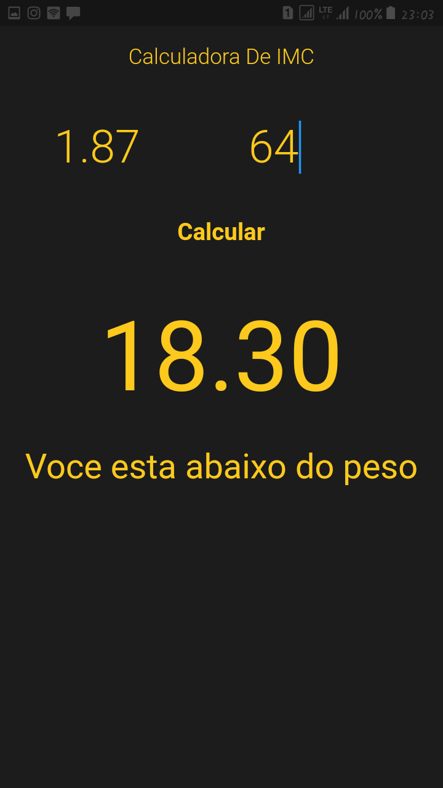

# Calculadora de Indice de Massa Corporal

## Porque?

Este projeto faz parte do meu portfólio pessoal, e ficarei feliz se você podece dar algum feedback sobre o projeto, código, estrutura ou qualquer comentário que poderá me tornar um programador melhor!

Email: henerypaina@gmail.com

[Linkedin](https://www.linkedin.com/in/henery-paina-03b0a5136/)

## Algumas observações sobre o aplicativo

1 - Este é um aplicativo de calculo de índice de massa corporal, que calcula o seu IMC.

## Funcionalidades

Ao fornecer o seu peso e a sua altura o app calcula e informa se você esta: acima do peso, se você esta com o peso normal e se você esta abaixo do peso.

Muito Obrigado

## Licença
Este é um projeto com a licença MIT License
